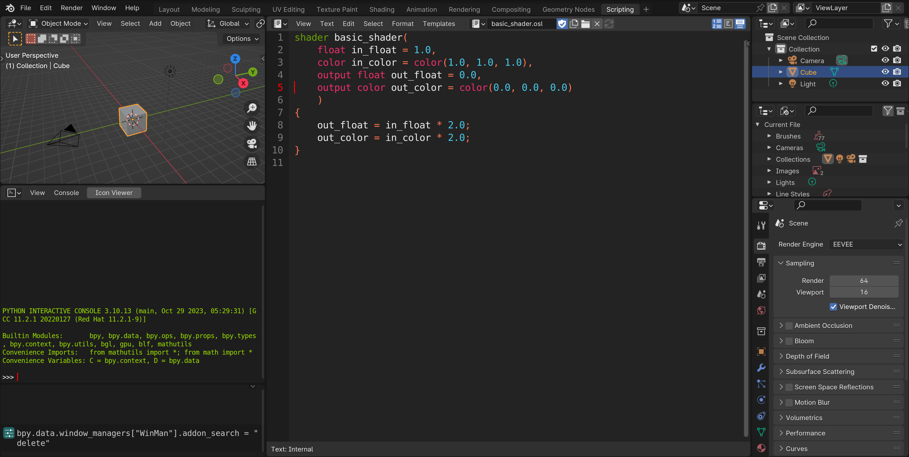

# Delete-line-in-text-editor-Blender-addon
Adds missing shortut for deleting the line just like in the VS Code.

## How to install?
  1. Download the .zip file.
  2. Open the Blender
  3. Open Preferences
  4. Install an addon button (top right corner).
  5. Select the zip file.

## Addon description
A small addon that adds the funcionality of deleting the current line in the text editor.  And it is also cuting the content into the clipboard. This means you can then paste the deleted line wherever you want.

You do not need to select anything. Just press CTRL + SHIFT + BACKSPACE while in the text editor.

### How it works?
The shortcut is then editable in the Blenders settings: "Edit > Preferences > Keymap > Text > Text global > Delete line". The way it works is mostly using Blenders built in functions:
1. Adding newline character to the current line.
2. Selecting the whole line.
3.  Cutting the selected content.
4. Deleting the remaining newline character.

That is all it is...

Video showcase on [youtube](https://www.youtube.com/watch?v=-JpoWFsWgH4).
